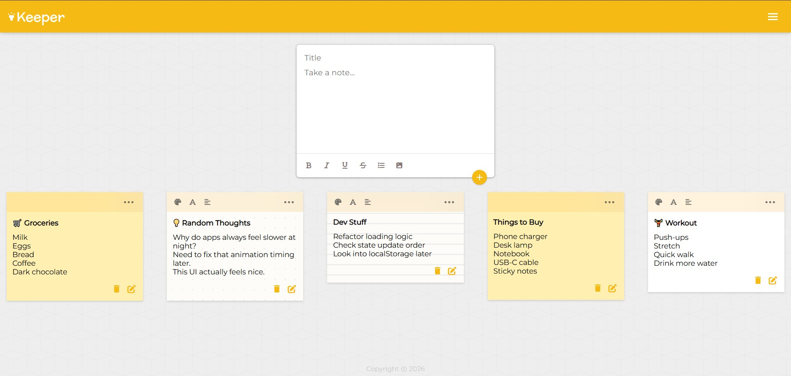

# 📝 React Keeper App

A modern and interactive **note-taking application** built with **React functional components**.  
This project goes beyond a basic keeper clone by adding a **rich text editor**, **editable notes**, **custom themes** and **animated UI interactions**.

---

## ✨ Features

- Create and delete notes dynamically
- Rich text editor tools (bold and extensible formatting options)
- Editable note title and content using inline editing
- Per-note theme switching (background styles & colors)
- Font size customization per note
- Text alignment toggle
- Animated UI elements using Material UI (`Zoom`, `Fab`)
- Dropdown tools menu with hover labels
- Unique IDs for notes using `uuid`
- Loading screen with lifecycle-based control using `useEffect`
- Clean, modern UI with custom CSS
- Component-based and scalable architecture

---

## 🛠️ Built With

- **React** (Functional Components)
- **React Hooks** (`useState`, `useEffect`)
- **Vite** (Fast development environment)
- **Material UI (MUI)** (Animations & UI components)
- **UUID** (Unique note identifiers)
- **Font Awesome** (Editor & UI icons)
- **CSS** (Custom styling)
- **JavaScript (ES6)**

---

## 📸 Demo

Here’s what the app looks like:

---
